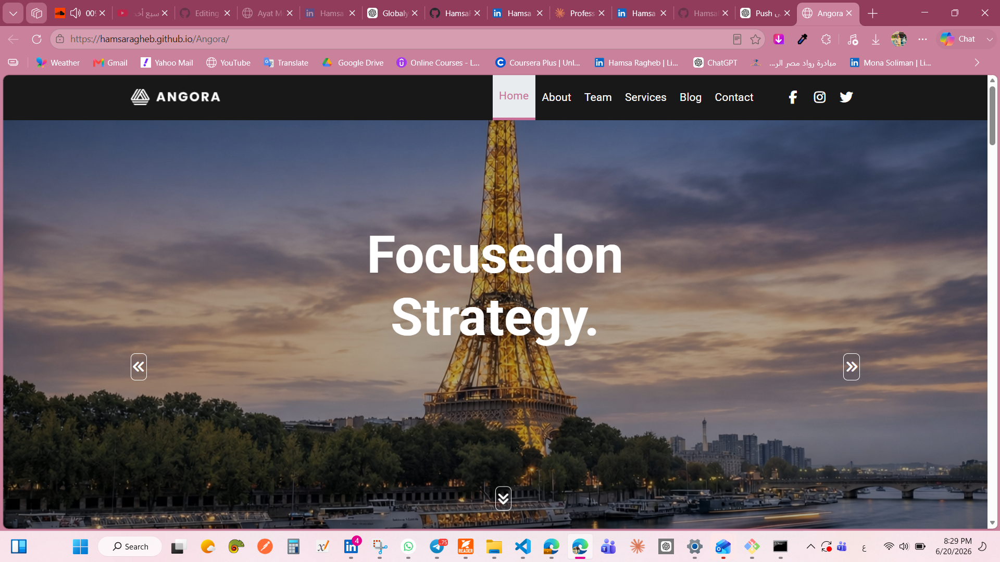

# 🚀 Angora | Creative Agency Website

A modern and fully responsive creative agency website built with HTML5, CSS3, Bootstrap 5, and JavaScript. The project showcases a professional business landing page with smooth animations, interactive UI components, team profiles, client testimonials, and responsive layouts optimized for all devices.

## 🌐 Live Demo

🔗 https://hamsaragheb.github.io/Angora/

---

## 📸 Preview



---

## 🎯 Project Overview

Angora is a multi-section agency website designed to demonstrate modern front-end development techniques, responsive design principles, Bootstrap customization, and JavaScript-powered user interactions.

The project focuses on delivering a clean user experience while maintaining performance, accessibility, and visual appeal.

---

## ✨ Features

### 🎨 User Interface

* Modern agency-style design
* Fully responsive layout
* Sticky navigation bar
* Smooth scrolling navigation
* Professional typography
* Interactive hover effects

### ⚡ Interactive Functionality

* Animated loading screen
* Dynamic hero image slider
* Auto-changing backgrounds
* Skill progress bar animations
* Team member hover overlays
* Client reviews carousel
* Scroll-to-top button

### 📱 Responsive Design

* Mobile-first approach
* Optimized for:

  * Desktop
  * Laptop
  * Tablet
  * Mobile

---

## 🛠️ Technologies Used

### Front-End

* HTML5
* CSS3
* JavaScript (ES6)
* Bootstrap 5

### Libraries & Tools

* jQuery
* Owl Carousel 2
* Font Awesome
* Google Fonts

---

## 📂 Project Structure

```bash
Angora/
│
├── README.md
├── preview.png
├── index.html
│
├── css/
│   ├── style.css
│   └── bootstrap.min.css
│
├── js/
│   ├── script.js
│   └── bootstrap.bundle.min.js
│
└── images/
```

---

## 🎨 Main Sections

### Home

Dynamic hero section with background slider and navigation controls.

### About

Company introduction with animated skill progress indicators.

### Team

Interactive team cards with social media hover effects.

### Services

Responsive service cards built using Bootstrap Grid.

### Client Reviews

Custom testimonial carousel with dynamic review switching.

### Contact

Professional contact form and contact information section.

### Footer

Multi-column footer with links, contact information, social media, and tags.

---

## 📈 Performance Highlights

* Semantic HTML structure
* Clean and maintainable CSS
* Reusable Bootstrap components
* Optimized JavaScript interactions
* Responsive images and layouts
* Cross-device compatibility

---

## 🔧 Installation

```bash
git clone https://github.com/HamsaRagheb/Angora.git
cd Angora
```

Open `index.html` in your browser or run the project using VS Code Live Server.

---

## 📚 What I Learned

* Building responsive websites with Bootstrap 5
* Creating dynamic sliders using JavaScript
* DOM manipulation and event handling
* Implementing responsive navigation systems
* Working with third-party libraries
* Creating interactive user experiences
* Structuring scalable front-end projects

---

## 👩‍💻 Author

**Hamsa Ragheb**

Front-End Developer

### Connect With Me

* GitHub: https://github.com/HamsaRagheb
* LinkedIn: https://www.linkedin.com/in/hamsa-ragheb/
* Email: [hamssaraghebzikrallah@gmail.com](mailto:hamssaraghebzikrallah@gmail.com)

---

## ⭐ Support

If you found this project useful, consider giving it a ⭐ on GitHub.
